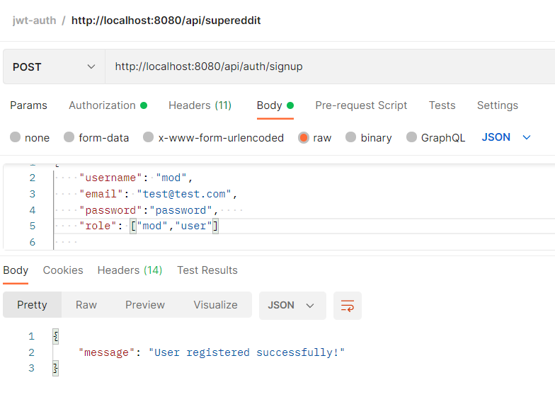
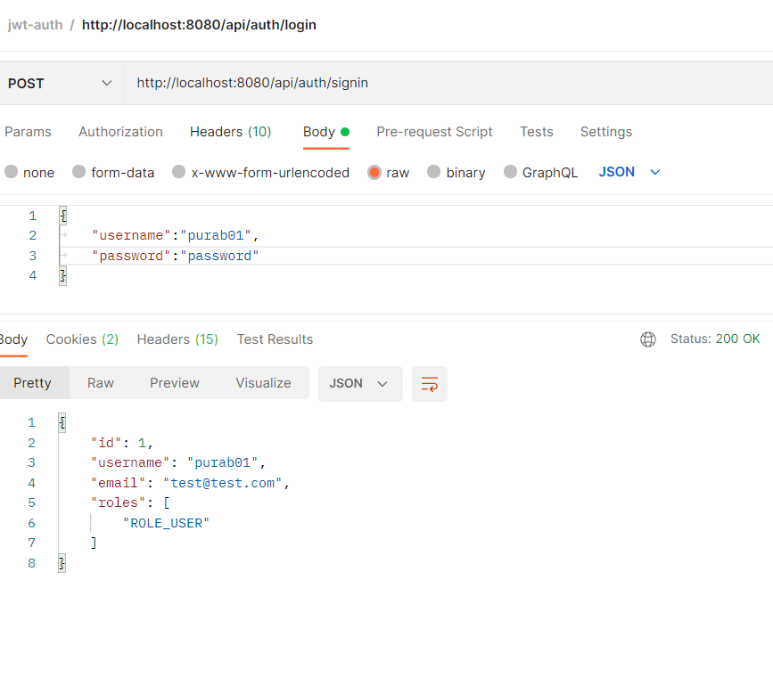

# spring boot jwt-demo - sample code
Spring boot app with jwt token

We also need to add some rows into roles table before assigning any role to User.
Run following SQL insert statements:
```
INSERT INTO roles(name) VALUES('ROLE_USER');
INSERT INTO roles(name) VALUES('ROLE_MODERATOR');
INSERT INTO roles(name) VALUES('ROLE_ADMIN');

```


Methods	Urls	Actions
POST	/api/auth/signup	signup new account
POST	/api/auth/signin	login an account
POST	/api/auth/signout	logout the account
GET	/api/test/all	retrieve public content
GET	/api/test/user	access User’s content
GET	/api/test/mod	access Moderator’s content
GET	/api/test/admin	access Admin’s content

Example Postman

1. Signup

2. Login

3. all api
